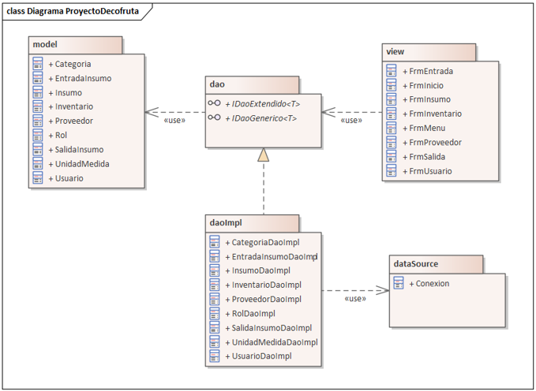
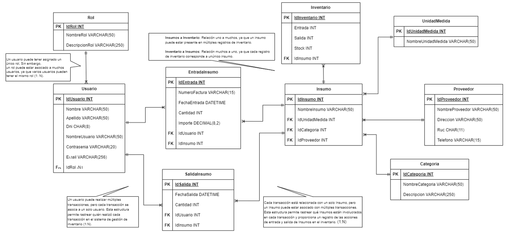
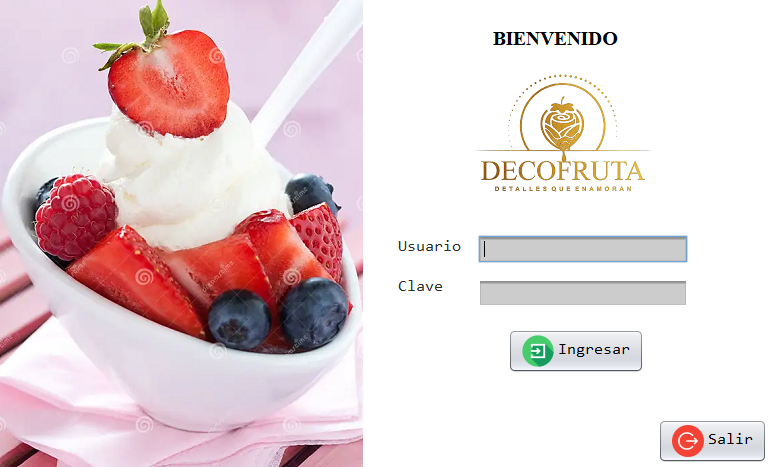
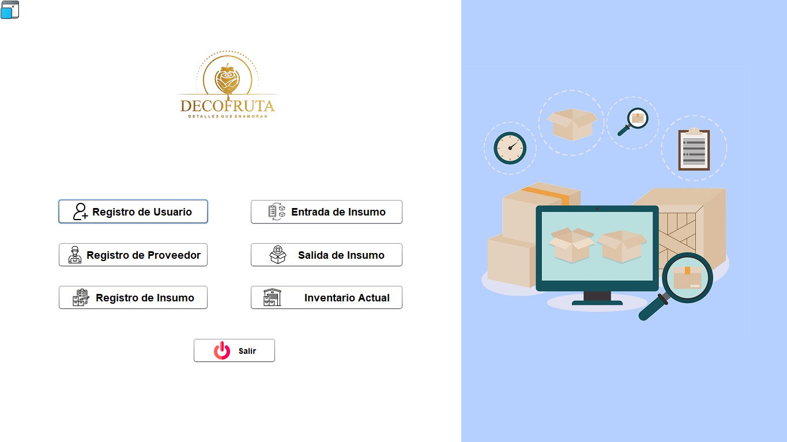
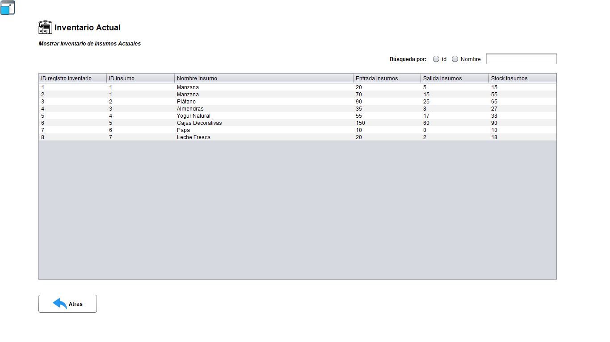
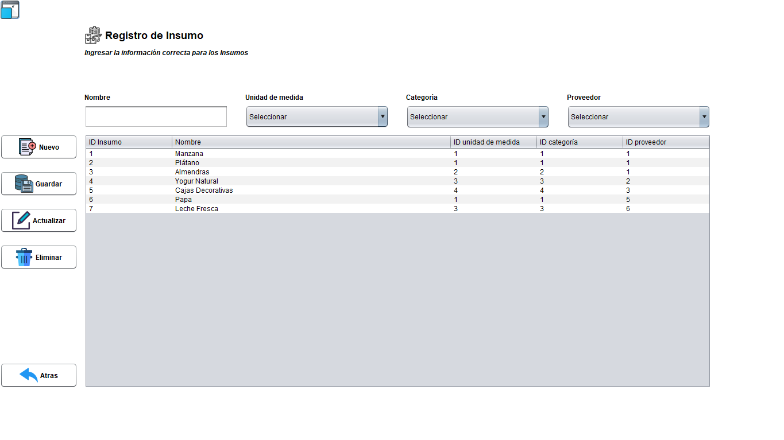

# 🧺 Sistema de Gestión de Inventario - Decofruta

Aplicación de escritorio desarrollada en **Java** para automatizar el control de inventarios del restaurante **Decofruta Detalles que Enamoran S.R.L.**  
Este proyecto fue elaborado como **trabajo final del curso “Programación Orientada a Objetos” (2023)** de la carrera de **Ingeniería de Sistemas e Informática**

---

## 🚀 Características principales

- **Inicio de sesión seguro** con roles (Administrador, Encargado, Empleado)
- **Gestión de usuarios**, proveedores e insumos
- **Control de entradas y salidas de inventario** con historial de movimientos
- **Diseño de base de datos normalizado**
- **Arquitectura basada en DAO** (Data Access Object)
- **Interfaz gráfica** intuitiva y a pantalla completa

---

## 🧠 Arquitectura del sistema

El sistema fue diseñado aplicando el patrón **DAO (Data Access Object)**, lo que permite mantener una separación clara entre la lógica de negocio y el acceso a datos.  
Además, sigue los principios del **modelo MVC** (Modelo-Vista-Controlador) para mejorar la organización del código y facilitar su mantenimiento.

📌 **Diagrama general del modelo del sistema:**

---

## 🗃️ Diseño de la base de datos

La base de datos fue desarrollada en **SQL Server** y normalizada para optimizar el almacenamiento y acceso a los datos.  
Incluye tablas para usuarios, proveedores, insumos, movimientos y roles de acceso.

📌 **Diseño de la base de datos:**

---

## 🖥️ Capturas de la aplicación

### 🔑 Pantalla de inicio de sesión
Permite el acceso seguro al sistema mediante credenciales de usuario.

---

### 🧭 Menú principal
Interfaz principal del sistema con las opciones disponibles según el rol del usuario.

---

### 📦 Gestión de inventario
Permite visualizar y actualizar en tiempo real el stock disponible.

---

### 🧾 Registro de insumos
Formulario para registrar nuevos productos e insumos con sus respectivos proveedores y categorías.

---

## 🧩 Tecnologías utilizadas

| Componente | Tecnología |
|-------------|-------------|
| Lenguaje principal | Java (JDK 17 o superior recomendado) |
| IDE utilizado | NetBeans |
| Base de datos | SQL Server |
| Patrón de diseño | DAO / MVC |
| Librerías | JDBC, JBCRYPT, DOTENV |

---

